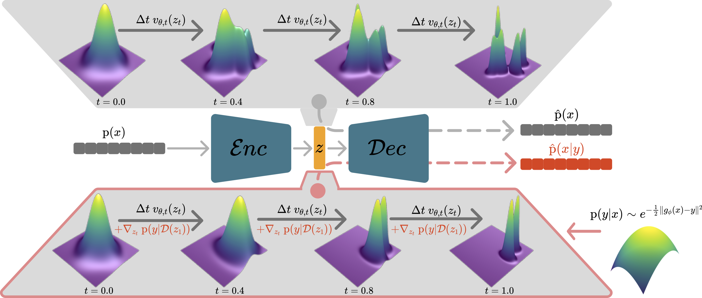

# VLGPO: Variational Latent Generative Protein Optimization

[](https://arxiv.org/abs/2501.19200)

This repository contains the official implementation of the paper "A Variational Perspective on Generative Protein Fitness Optimization".

[Lea Bogensperger](https://scholar.google.com/citations?user=4cNGQ0sAAAAJ&hl=en)<sup>1</sup>,
[Dominik Narnhofer](https://scholar.google.com/citations?user=tFx8AhkAAAAJ&hl=en)<sup>2</sup>, 
[Ahmed Allam](https://scholar.google.com/citations?user=xcuCdJUAAAAJ&hl=en&oi=sra)<sup>1</sup>, 
[Konrad Schindler](https://scholar.google.com/citations?user=FZuNgqIAAAAJ&hl=en&oi=ao)<sup>2</sup>, 
[Michael Krauthammer](https://scholar.google.com/citations?user=Cgq2_M0AAAAJ&hl=en&oi=ao)<sup>1</sup>

<sup>1</sup>University of Zurich, 
<sup>2</sup>ETH Zurich



---

## 🛠️ Setup

The VLGPO sampling code was tested using Python 3.11.10 and CUDA 12.4 on an NVIDIA GeForce RTX 4090 GPU. 

Checkpoints for the predictors $g_\phi$ and $g_{\tilde{\phi}}$ (classifier guidance) and the in-silico oracle $g_\psi$ (evaluation) are taken from [GGS: Gibbs sampling with Graph-based Smoothing](https://github.com/kirjner/GGS). 

### 📦 Repository

Download the VLGPO repository using

```bash
git clone https://github.com/uzh-dqbm-cmi/VLGPO.git
```

### 💻 Dependencies

To run this project, you'll need the following Python packages:

- **[PyTorch](https://pytorch.org/)**
- **[NumPy](https://numpy.org/)** 
- **[Pandas](https://pandas.pydata.org/)** 
- **[python-Levenshtein](https://pypi.org/project/python-Levenshtein/)** 
- **[OmegaConf](https://omegaconf.readthedocs.io/)** 
- **[einops](https://einops.rocks/)** 


### 🚀 Run code

Run the VLGPO sampling code (possible settings are ```gfp_medium```, ```gfp_hard```, ```aav_medium``` and ```aav_hard```) using

```bash
python src/vlgpo/sample.py <setting>
```

## 🎓 Citation

If you find our work helpful, please consider citing:

```bibtex
@misc{bogensperger2025variationalperspectivegenerativeprotein,
      title={A Variational Perspective on Generative Protein Fitness Optimization}, 
      author={Lea Bogensperger and Dominik Narnhofer and Ahmed Allam and Konrad Schindler and Michael Krauthammer},
      year={2025},
      eprint={2501.19200},
      archivePrefix={arXiv},
      primaryClass={cs.LG},
      url={https://arxiv.org/abs/2501.19200}, 
}